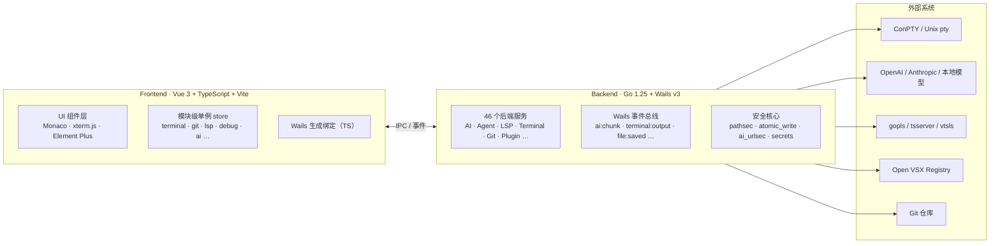

<div align="center">


# Koyori IDE · こより IDE 🐾

**一款离线优先的桌面 AI IDE，为你、为代码、为喵生。**(✧ω✧)

基于 **Go (Wails v3) + Vue 3 + Monaco Editor** 构建，单文件打包、离线优先、本地工具链优先——喵，断网也能好好写代码哦。

[](LICENSE)


**喵 ~ こんにちは！这里是 Koyori IDE，你的桌面 AI 编程搭子。**

</div>

---

## 📖 这是什么呀？

Koyori IDE（こより IDE）是一个**离线优先**的桌面 AI IDE，专为 **Go / TypeScript / JavaScript** 开发者设计。

- 🧰 **本地工具链**：`go build/test/vet`、`gofmt`、`golangci-lint`、`tsc`、`eslint`、`prettier`、`vitest` 一键调用，无需联网。
- 🔌 **离线 LSP**：自动发现 `gopls` / `typescript-language-server` / `vtsls`；能力取决于本机真实安装的语言服务器，缺失时明确降级，**绝不把 mock 当可用服务**（诚实喵！）。
- 🤖 **AI 增强**：OpenAI Chat Completions 风格 + Anthropic Messages 双协议 SSE 流式对话，支持 Ollama / LM Studio 等本地端点。
- 🐾 **自治 Agent**：读文件、写文件、运行命令、Git 操作——**所有命令强制人工审批**，没有 Safe 自动批准旁路，安全喵！
- 🧩 **可扩展**：原生插件（Web Worker 沙箱）+ Open VSX 插件市场（SHA-256 校验、权限分级）。

> ⚠️ **诚实声明**：Koyori IDE 当前为 **0.x 实验版本**，构建在 Wails v3 **beta.8** 之上。它不是 VS Code、Cursor 或 IntelliJ 的替代品，**不宣称生产级或企业就绪**。部分能力（远程开发、VSIX 兼容层、调试适配器、发布供应链）只有源码/单元/契约证据，未经真实外部系统端到端验证。详见下方[验证边界](#当前能力与验证边界vsu)。

---

## ✨ 功能特性

### 📝 编辑器

| 特性 | 说明 |
|---|---|
| Monaco 内核 | 与 VS Code 同款编辑器内核，20+ 语言语法高亮 |
| 多标签页 | 脏状态指示、未保存提示、Ctrl+S 全局保存 |
| Diff 视图 | Myers diff 逐行对比，Git 冲突解决 |
| Markdown 预览 | 分栏渲染 + 语法高亮（highlight.js，DOMPurify 消毒） |
| 内联 AI 补全 | 幽灵文本补全，debounce + AbortSignal 取消 |
| 快速打开 | Ctrl+P 模糊搜索工作区文件 |

### 🤖 AI 助手

- 多 Provider 配置，无限保存、一键切换
- OpenAI（`/v1/chat/completions`）与 Anthropic（`/v1/messages`）双协议原生支持
- SSE 流式响应，`ai:chunk` / `ai:done` / `ai:error` 事件驱动
- 9 个右键代码动作：解释、重构、修 Bug、生成文档/测试、优化、审查、安全审计、提交信息
- 对话历史持久化（原子写 + 路径沙箱）；自动加载 `.cursorrules` / `AGENTS.md` / `.koyori-ide/rules.md` 项目规则
- 瞬时错误自动重试 + 指数退避；温度 / maxTokens 可配置

### 🐾 自治 Agent

- 工具调用：读/写文件、运行命令、搜索代码、Git 操作
- **命令强制人工审批**，风险分级 Safe / Elevated / Dangerous 逐工具审批
- 审计日志全程记录；单轮上限 **20 次工具** 调用（`MAX_TOOL_CALLS`），防无限循环

### 🔌 离线 LSP（G-FEAT-02）

- Go：gopls（补全、悬停、定义跳转、签名、格式化、重命名、测试导航）
- TS/JS：typescript-language-server / vtsls（含 auto-import、代码操作）
- 断网检测：`navigator.onLine` + 心跳 BaseURL，离线时 UI 显示「离线补全」徽标
- LSP 给符号补全，AI 给行/块级意图补全，协同不冲突

### 🧰 工具链集成（G-FEAT-03）

| 语言 | 工具 |
|---|---|
| Go | go build/test/vet/mod tidy · gofmt · goimports · golangci-lint |
| TS/JS | tsc --noEmit · eslint --fix · prettier · vitest · npm/pnpm/yarn scripts 树 |
| 通用 | Makefile target 视图 · `.vscode/tasks.json` 兼容 · package.json scripts |

### 🖥️ 内置终端

- 完整 PTY：Windows ConPTY / Unix pty（`creack/pty`）
- xterm.js 渲染，多标签会话，可配置 PowerShell / bash / zsh
- UTF-8 安全输出（跨平台多字节字符正确处理）、1 MiB 输出缓冲上限

### 🌿 Git 集成

- 分支显示与 ahead/behind 跟踪；文件状态列表；单文件暂存/取消暂存（路径校验）
- 提交、Rebase 与冲突解决、Worktree、Pull Request
- **AI 代码审查**：分析未提交变更，逐文件输出结构化意见

### 🧩 插件系统与市场

- 原生插件（用户全局 + 项目级），manifest 校验，命令注册
- Web Worker 沙箱：无 DOM/window/localStorage 访问，postMessage RPC，权限 fail-closed
- Open VSX Registry 客户端：搜索 / 下载 / 安装 VSIX / SHA-256 校验
- 安全分级 Trusted / Reviewed / Restricted，黑名单拦截，受限 API 弹窗审批

### 🛠️ 其他工具窗与能力

| 能力 | 说明 |
|---|---|
| 调试 / 测试 | 内置 Go Delve DAP + Node CDP；测试发现（package/file/cursor）、覆盖率 gutter |
| 远程开发 | 最小 SSH/SFTP：远程文件操作、watch、受限命令（**无**远端 PTY / Agent / 端口转发） |
| 双窗 SSOT | 主窗 + AI 伴侣窗设置/会话同步，CAS 冲突处理，Agent 审批仅发起窗 |
| HTTP Client / Database | 出站请求调试面板；数据库工具窗 |
| 搜索替换 | 全文搜索 + 正则 + 替换 |
| 快照 / 恢复 | 快照与本地历史；异常退出后脏缓冲恢复 |
| 更新 / 崩溃 | E2 更新流（检查 + SHA-256 校验，手动安装）；崩溃报告 |
| 个性化 | 三套设计语言（Material You / Apple HIG / Claude）、8 种强调色、明暗模式、i18n（en/zh/ja） |
| 其他 | PProf 性能分析、Skills 注册表、MCP 客户端、出站 IM 通知、项目脚手架模板 |

### 🏗️ 项目脚手架（G-FEAT-01）

命令面板 `koyoriIde: New Project` 向导，模板内嵌（`go:embed`）离线可用：Go / TypeScript / JavaScript / Monorepo / 全栈。

---

### 当前能力与验证边界（V/S/U）

> `V` = 本机实际命令通过；`S` = 源码、单元测试或协议契约存在，但对应真实外部系统未在本机运行；`U` = 需要真实 provider、服务器、平台、签名凭据、CI run 或打包产物，当前没有可核验证据。单元/mock 测试通过**不会**把真实集成升级为 `V`。

| 能力 | 等级 | 已验证范围与明确缺口 |
|---|---|---|
| 本地编辑与保存 | **V / U** | [事务/冲突测试](services/recovery_service_test.go) 与 [E2E 边界](docs/E2E.md)通过；真实打包 WebView 工作流仍 U |
| Git | **V / U** | [真实临时仓库测试](services/git_service_test.go) + [前端入口测试](frontend/src/api/gitService.test.ts)通过；打包应用内人工流程未运行 |
| LSP | **S / U** | [协议/契约测试](services/lsp_service_test.go)覆盖；本机 `gopls`、`typescript-language-server`、`vtsls` 均未安装，无真实语言服务器会话，边界见 [RELEASING](docs/RELEASING.md#lsp-and-debugger-release-claims) |
| AI | **V / U** | [SSE/双协议测试](services/ai_service_test.go)与 [provider 边界](docs/RELEASING.md#lsp-and-debugger-release-claims)通过；未调用真实 provider |
| Agent | **V / U** | [审批/预算/写事务测试](services/agent_service_test.go)通过；无真实模型端到端会话 |
| Recovery | **V / U** | [恢复测试](services/recovery_service_test.go)通过；真实 SIGKILL/restart 证据以 [E2E 状态](docs/E2E.md#platform-status)为准 |
| 最小 Remote | **S / U** | [RemoteService 测试](services/remote_service_test.go)覆盖；无真实 SSH 服务器，无远端 PTY/Agent/端口转发 |
| Debug / Test | **V / S / U** | [Debug/Test 测试](services/debug_service_test.go)与 [真实会话边界](docs/RELEASING.md#lsp-and-debugger-release-claims)；无真实 Delve/Node 会话 |
| 插件 / VSIX | **V / S / U** | [扩展安全测试](services/extension_security_service_test.go)与 [兼容矩阵](docs/EXTENSION-COMPATIBILITY.md)通过；未做真实 Open VSX 大规模兼容运行 |
| 发布供应链 | **V / S / U** | [RELEASING](docs/RELEASING.md)、[依赖清单](docs/THIRD_PARTY_LICENSES.md)与 [资产清单](docs/RELEASE_ASSET_LICENSES.md)源码契约通过；真实四平台产物、签名、公证、packaged E2E 均 U |

**能力边界**：Computer Use 默认关闭（三平台均为 unsupported stub）；IM 仅出站通知；VSIX 是受限兼容子集而非完整 VS Code Extension API；远程开发不是 Remote-SSH。详见 [docs/ARCHITECTURE.md](docs/ARCHITECTURE.md) 与 [.github/SECURITY.md](.github/SECURITY.md)。

---

## 🏗️ 架构总览



| 层级 | 技术 |
|---|---|
| 后端 | Go 1.25 · Wails v3 (`v3.0.0-beta.8`，go.mod 精确锁定) |
| 前端 | Vue 3 · TypeScript 5 · Vite 8 · Tailwind CSS v4 |
| 编辑器 | Monaco Editor 0.52 |
| UI | Element Plus 2.14 |
| 终端 | xterm.js 6 · ConPTY (Windows) / creack/pty (Unix) |
| Git | go-git v5 |
| AI | OpenAI 风格 + Anthropic 原生协议（SSE） |
| Markdown | marked · highlight.js · DOMPurify |

关键设计：

- 服务只通过仓库锁定的 Wails 生成绑定暴露给前端；ID/FQN 不允许手算。修改导出方法后运行 `node scripts/generate-bindings.mjs`，审查并显式更新导出 manifest，再跑完整漂移门禁。
- 服务间构造器注入解耦；平台特定代码用构建标签分离（`pty_windows.go` / `pty_unix.go` 等）。
- AI 流式响应经事件总线驱动（避免 IPC 回调限制）；双窗状态经 `settings:changed` 等事件做 SSOT 同步。
- 安全能力集中化：`pathsec`（双侧 EvalSymlinks 路径校验）、`atomic_write`（temp+rename+0600）、`ai_urlsec`（SSRF/密钥外泄检测）、`secrets`（AES-256-GCM + DPAPI/Keychain/Secret Service）。

---

## 🚀 快速开始

### 📦 下载

> 发布产物尚未全部验证，请以 [Releases](https://github.com/CuTeLiTTleBraids-Geek-studio/koyori-ide/releases) 页面的 workflow run 与附件为准。发布证据清单见 [docs/RELEASING.md](docs/RELEASING.md)。

| 平台 | 产物 |
|---|---|
| Windows x64 | `koyori-ide-<version>-windows-amd64.zip`（需 WebView2，Win10/11 通常已内置） |
| Linux x64 | `koyori-ide-<version>-linux-amd64.tar.gz`（需与构建产物匹配的 GTK/WebKitGTK 运行库） |
| macOS x64 / ARM64 | `koyori-ide-<version>-darwin-amd64.zip` / `-darwin-arm64.zip` |

<details>
<summary><b>🖥️ Linux 依赖</b></summary>

发布流水线首选 GTK4 + WebKitGTK 6.0；`build/scripts/build-linux.sh` 在该组合不可用时回退到 GTK3 + WebKit2GTK 4.1，并让生成的 deb/rpm 依赖与实际构建标签保持一致。源码构建任选同一行中的一组依赖，不要混用两套 ABI：

| 发行版 | 首选（GTK4 / WebKitGTK 6.0） | 回退（GTK3 / WebKit2GTK 4.1） |
|---|---|---|
| Debian / Ubuntu | `libgtk-4-dev libwebkitgtk-6.0-dev` | `libgtk-3-dev libwebkit2gtk-4.1-dev` |
| Fedora / RHEL | `gtk4-devel webkitgtk6.0-devel` | `gtk3-devel webkit2gtk4.1-devel` |
| Arch Linux | `gtk4 webkitgtk-6.0` | `gtk3 webkit2gtk-4.1` |

还需要 C 编译器、`pkg-config`（Fedora 为 `pkgconf-pkg-config`）、`libgcc` 和 `libstdc++` 开发包。

</details>

### 🔨 从源码构建

| 工具 | 最低版本 |
|---|---|
| Go | 1.25 |
| Node.js | 20.19+ (or 22.12+) |
| Wails3 CLI | `v3.0.0-beta.8`（精确版本，需与 go.mod / CI 一致） |

```bash
# 1. 安装 Wails3 CLI
go install github.com/wailsapp/wails/v3/cmd/wails3@v3.0.0-beta.8

# 2. 克隆并安装前端依赖
git clone https://github.com/CuTeLiTTleBraids-Geek-studio/koyori-ide.git
cd koyori-ide
cd frontend && npm ci && cd ..

# 3a. 开发模式（前端热重载 + 后端自动重编译）
wails3 dev -config ./build/config.yml -port 9245

# 3b. 生产构建（在对应平台原生执行）
wails3 build -tags desktop,production
```

修改导出的 Go 服务方法后，重新生成并校验绑定：

```bash
node scripts/generate-bindings.mjs
node scripts/check-bindings.mjs
```

> **跨平台构建**：无法从 Windows 主机交叉编译 Linux/macOS 二进制（当前 Wails v3 beta.8 构建仍受构建约束、Taskfile Unix 命令与 CGO 依赖限制）。请使用 GitHub Actions（推送 `v*.*.*` 标签）、原生构建或 Docker `wails-cross` 镜像。详见 [docs/RELEASING.md](docs/RELEASING.md)。

---

## 📂 项目结构

```
koyori-ide/
├── main.go                       # Go 入口：服务注册、事件绑定、CSP nonce、资源嵌入
├── bootstrap_services.go         # 46 个后端服务的装配（appBundle）
├── main_test.go / g13_wiring_test.go # 根包测试：入口生命周期与装配接线（package main 约束）
├── go.mod / go.sum               # 模块 github.com/CuTeLiTTleBraids-Geek-studio/koyori-ide（Go 1.25）
├── Taskfile.yml                  # 开发/构建/门禁任务（含 bindings:check、docs:check）
├── VERSION                       # 版本单一事实来源（当前 0.2.0）
├── icon.png                      # 项目图标（release workflow 会将其放入发布资产）
├── scripts/                      # 发布、绑定检查、E2E 驱动、许可证清单等脚本
├── internal/
│   ├── e2e/                      # 打包级 E2E 端点（-tags e2e 编译，默认空 stub，KOYORI_IDE_E2E=1 启用）
│   └── repo/                     # 仓库治理测试：release 一致性 / README 诚实声明 / 仓库卫生
├── services/                     # Go 后端（46 服务 + 单元测试 + templates/ 脚手架模板）
├── frontend/                     # Vue 3 前端
│   ├── src/
│   │   ├── api/                  # Wails 绑定包装
│   │   ├── stores/               # 模块级单例 store（terminal、git、lsp、debug、agent…）
│   │   ├── components/           # ai-assistant / ai-window / editor / layout / settings / …
│   │   ├── composables/          # useKeyboard、useDragResize…
│   │   ├── lib/                  # markdown、i18n、Monaco 主题、插件沙箱、extensionHost/
│   │   ├── types/ views/ router/ assets/
│   │   └── *.test.ts             # Vitest 单测（与源码同目录）
│   ├── bindings/                 # Wails 生成绑定（github.com/CuTeLiTTleBraids-Geek-studio/koyori-ide/services/ 由构建生成，勿提交）
│   └── package.json
├── build/                        # 平台构建配置（windows/linux/darwin/android/ios/docker/scripts）
├── docs/                         # 架构、发布、E2E、协议设计 + prompts/（设计验证记录）
└── .github/                      # CI/CD workflows + SECURITY/CONTRIBUTING/CODE_OF_CONDUCT
```

> 设计/验证记录 `prompt-*.md` 归档在 [docs/prompts/](docs/prompts/prompt-1.md)，代码注释中的 `prompt-N Task X` 引用即指向这些记录。

---

## 🧪 开发与测试

```bash
# Go 后端测试（含竞态检测）
go test ./services/... -race -v

# Go 漏洞扫描
go run golang.org/x/vuln/cmd/govulncheck@latest ./services/... .

# 前端测试 / 类型检查 / lint
cd frontend && npx vitest run
cd frontend && npx vue-tsc --noEmit
cd frontend && npx eslint src

# 工程门禁（绑定一致性 + README/代码数字漂移）
task bindings:check
task docs:check
```

CI（[.github/workflows/ci.yml](.github/workflows/ci.yml)）覆盖三平台测试矩阵、`-tags e2e` 打包级 E2E、govulncheck、golangci-lint、npm audit（高严重度阻塞）。

---

## 🔒 安全

> 以下为代码中的防护实现摘要，不代表独立安全审计、SLA 或企业认证。

- **API Key 加密存储**：AES-256-GCM（随机 nonce）+ Windows DPAPI / macOS Keychain / Linux Secret Service
- **路径沙箱**：`pathsec.ValidatePathWithinRoot` 双侧 `EvalSymlinks`，符号链接逃逸拒绝
- **CSP**：每请求 16 字节 hex nonce，`script-src 'self' 'nonce-<N>'`，无 `unsafe-inline`
- **URL 校验**：AI BaseURL 经 SSRF 与 API Key 外泄检测
- **Agent 审批**：所有命令强制人工审批，无 Safe 自动批准旁路
- **插件沙箱**：Web Worker 隔离 + iframe `sandbox`（无 allow-same-origin）+ SHA-256 校验 + 黑名单
- **DOMPurify 全覆盖**：所有 `v-html` 经消毒，外链强制 `noopener noreferrer`
- **原子写 / 单实例锁**：关键配置 temp+rename 原子写，敏感文件 0600

完整政策与漏洞报告流程（[security/advisories/new](https://github.com/CuTeLiTTleBraids-Geek-studio/koyori-ide/security/advisories/new)）：[.github/SECURITY.md](.github/SECURITY.md)

---

## 📚 文档

| 文档 | 说明 |
|---|---|
| [docs/ARCHITECTURE.md](docs/ARCHITECTURE.md) | 架构总览与服务列表 |
| [docs/RELEASING.md](docs/RELEASING.md) | 发布工程与证据要求 |
| [docs/RELEASE_ASSET_LICENSES.md](docs/RELEASE_ASSET_LICENSES.md) | 发布资产来源、哈希与许可证边界 |
| [docs/CHANGELOG.md](docs/CHANGELOG.md) | 变更日志 |
| [docs/E2E.md](docs/E2E.md) | 打包级 E2E 流程 |
| [docs/EXTENSION-COMPATIBILITY.md](docs/EXTENSION-COMPATIBILITY.md) | 扩展 API 兼容矩阵 |
| [docs/HOST-CLIENT-PROTOCOL.md](docs/HOST-CLIENT-PROTOCOL.md) · [LANGUAGE-PACK-SDK.md](docs/LANGUAGE-PACK-SDK.md) · [EXTENSION-CONTRIBUTION-PROTOCOL.md](docs/EXTENSION-CONTRIBUTION-PROTOCOL.md) | 协议设计草案（未实现） |
| [docs/THIRD_PARTY_LICENSES.md](docs/THIRD_PARTY_LICENSES.md) | 三方许可证清单 |

---

## 🤝 贡献

欢迎 Issue 与 PR 喵！

- 提交信息遵循 [Conventional Commits](https://www.conventionalcommits.org/)
- Go：`gofmt` + [golangci-lint CI](.github/workflows/ci.yml)
- TypeScript/Vue：ESLint（[frontend/eslint.config.js](frontend/eslint.config.js)）
- 流程详见 [.github/CONTRIBUTING.md](.github/CONTRIBUTING.md)
- 行为准则：[.github/CODE_OF_CONDUCT.md](.github/CODE_OF_CONDUCT.md)
- 安全漏洞请按 [.github/SECURITY.md](.github/SECURITY.md) 私下报告，勿公开 Issue

---

## 📜 协议

[LICENSE](LICENSE) · **MIT License** · Copyright (c) 2026 koyori-ide contributors

构建于以下开源项目之上：Wails · Monaco Editor · Element Plus · go-git · xterm.js · highlight.js · marked · DOMPurify · gopls · TypeScript · Open VSX Registry

---

## 💌 联系

| 渠道 | 方式 |
|---|---|
| QQ 群 | `603299757`（加群请注明「koyori-ide 用户」） |
| Telegram | https://t.me/nknkmiao |
| 邮箱 | dianasoylu423@gmail.com |

---

# 🐾 English Overview

**Koyori IDE** is an offline-first desktop AI IDE for **Go / TypeScript / JavaScript**, built with **Go (Wails v3 beta.8) + Vue 3 + Monaco Editor** and designed for single-binary packaging. Nya~! 🐱

| Area | Summary |
|---|---|
| Editor | Monaco, multi-tab, diff view, markdown preview, inline AI ghost text, Ctrl+P quick open |
| AI | OpenAI-style + Anthropic-native SSE streaming, multi-provider profiles, conversation history, project rules (`.cursorrules` / `AGENTS.md` / `.koyori-ide/rules.md`) |
| Agent | Tool use with **mandatory human approval** for every command (no safe auto-run bypass) |
| LSP | Offline gopls / typescript-language-server / vtsls discovery and sessions |
| Terminal | Real PTY (ConPTY / Unix pty) with xterm.js, multi-tab, UTF-8 safe |
| Git | status, stage, commit, rebase, worktrees, PRs, AI review of uncommitted changes |
| Plugins | worker-sandboxed native plugins + Open VSX marketplace with SHA-256 checks |
| Debug/Test | Built-in Delve DAP + Node CDP, test discovery, coverage |

**Honest boundaries**: this is a 0.x experimental project on Wails v3 beta — **not a replacement for VS Code, Cursor, or IntelliJ**, and **not production- or enterprise-ready**. Remote development is a minimal SSH/SFTP surface (no remote PTY/agent/port forwarding), VSIX support is a constrained permission-gated subset of the VS Code Extension API, and `gopls` / `typescript-language-server` / `vtsls` were absent from the verification machine, so no real LSP session is claimed. See the [verification boundary table](#当前能力与验证边界vsu) above and [docs/ARCHITECTURE.md](docs/ARCHITECTURE.md).

**Quick start**: Go 1.25 + Node 20.19+ (or 22.12+) + `wails3` CLI (exact `v3.0.0-beta.8`), then `cd frontend && npm ci && cd ..` and `wails3 dev -config ./build/config.yml -port 9245`. Production: `wails3 build -tags desktop,production` (native platform only).

**License**: [MIT](LICENSE)
